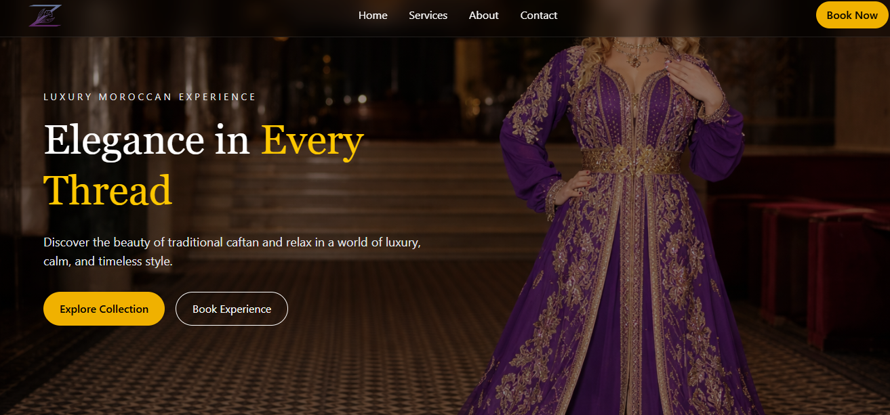
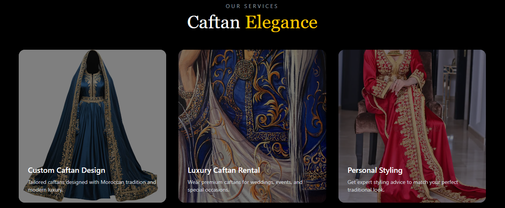
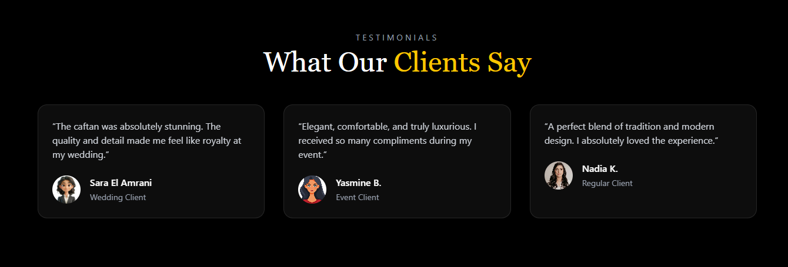
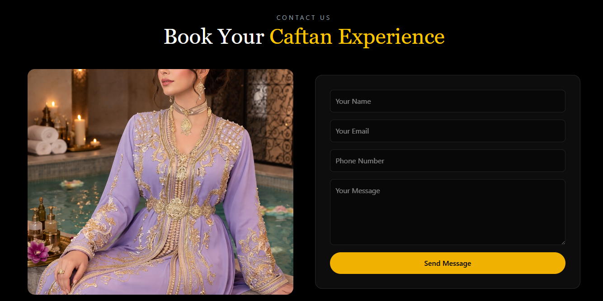

````md
# 🌟 Caftan Luxury Website

A modern and elegant **React + Tailwind CSS landing page** for a luxury Moroccan caftan brand.  
This project delivers a premium fashion experience with smooth UI, responsive design, and a luxurious aesthetic.

---

## 🔗 Repository

👉 https://github.com/KaiserOfTheNight/caftan-luxury

---

## 📸 Preview

> Add screenshots in a `/screenshots` folder

### 🖤 Hero Section


### 🧵 Services Section


### ℹ️ About Section


### 💬 Testimonials


### 📩 Contact Section


### 👣 Footer


---

## ✨ Features

- 🖤 Luxury dark theme UI
- 📱 Fully responsive design (mobile + desktop)
- 🍔 Mobile side navigation menu
- 🧭 Smooth scroll navigation
- 🖼️ Hero section with full background image
- 🧵 Services section (3 elegant cards)
- ℹ️ About section with image + text layout
- 💬 Testimonials with client reviews
- 📩 Contact form UI
- 👣 Modern footer design
- ⚡ Built with React + Tailwind CSS

---

## 🛠️ Tech Stack

- React.js ⚛️  
- Tailwind CSS 🎨  
- Vite ⚡  
- JavaScript (ES6+)

---

## 📁 Project Structure

```bash
src/
 ├── components/
 │    ├── Navbar.jsx
 │    ├── Hero.jsx
 │    ├── Services.jsx
 │    ├── About.jsx
 │    ├── Testimonials.jsx
 │    ├── Contact.jsx
 │    └── Footer.jsx
 ├── App.jsx
 └── main.jsx
````

---

## 🚀 Getting Started

### 1. Clone the repository

```bash
git clone https://github.com/KaiserOfTheNight/caftan-luxury.git
```

### 2. Install dependencies

```bash
npm install
```

### 3. Run the project

```bash
npm run dev
```

---

## 🎯 Purpose

This project was built to practice modern frontend development by creating a luxury fashion/spa landing page inspired by Moroccan caftan aesthetics.

---

## 🔮 Future Improvements

* ✨ Framer Motion animations
* 🛍️ E-commerce integration
* 📦 Booking system
* 🌍 Multi-language support (AR / FR / EN)
* 🔐 Admin dashboard

---

## 👨‍💻 Author

Built with ❤️ by **KaiserOfTheNight**

```

---

# 💡 If you want next upgrade 🔥
I can also:
- :contentReference[oaicite:0]{index=0}
- :contentReference[oaicite:1]{index=1}
- or :contentReference[oaicite:2]{index=2}

Just tell me 👍
```
